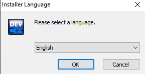
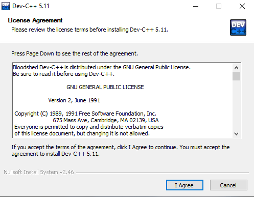
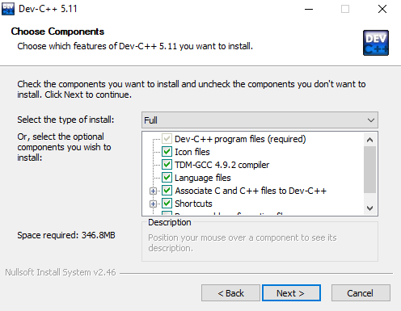
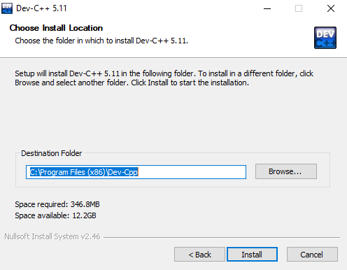
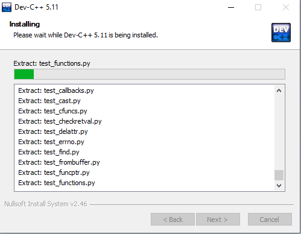
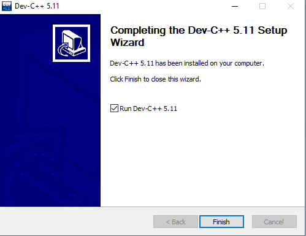

# BAB 01 Install Dev-C++
On **BAB 01** this just tutorial install Apps Dev-C++
## Request Tools 
[Dev C++ Ver. 5.11(Only on Windows)](https://sourceforge.net/projects/orwelldevcpp/)

## How to install Dev C++ on Windows

1. Select you language, i choose <b>"English"</b>,

2. Later it will appear like this License Agreement Click <b>"I Agree"</b>,

3. And Choose Components, i choose <b>"Full"</b> and click <b>"Next"</b>,

4. Choose Install Location, i choose the default location, <b>``"C:\Program Files (x86)\Dev-Cpp"``</b>

5. Waiting to the installation to done

6. Finish the installation you can tick <b>"Run Dev-C++ xxx"</b> and click <b>"Finish"</b>

7. This is the interface of the Dev C++ application

