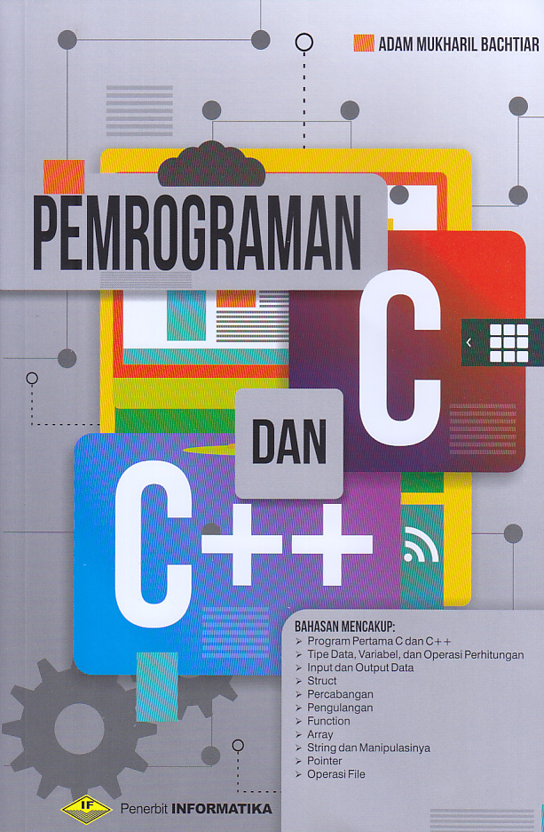

# Indonesia

||Informasi|
|---|---|
|Judul|: Pemrograman C dan C++|
|Pengarang|: Adam Mukharil Bachtiar|
|Penerbit|: Informatika Bandung|
|Cetakan|: Pertama 2017|
|Bahasa|: Indonesia|
|Halaman|: 323 Halaman|

 

## Daftar Isi

1. [Pendahuluan](/BAB01/)
2. [Programan Pertama C dan C++](/BAB02/)
3. [Tipe Data, Variabel, dan Operasi Perhitungan](/BAB03/)
4. [Input dan Output Data](/BAB04/)
5. [Struct](/BAB05/)
6. [Percabangan](/BAB06/)
7. [Pengulangan](/BAB07/)
8. [Function](/BAB08/)
9. [Array](/BAB09/)
10. [String dan Manipulasinya](/BAB10/)
11. [Pointer](/BAB11/)
12. [Operasi file](/BAB12/)

# English

||Information|
|---|---|
|Title|: Pemrograman C dan C++|
|Author|: Adam Mukharil Bachtiar|
|Publisher|: Informatika Bandung|
|Prints|: First 2017|
|Language|: Indonesian|
|Pages|: 323 Pages|
 

## List of Contents

1. [Introduction](/CHAPTER01/)
2. [First Program of C and C++](/CHAPTER02/)
3. [Data Types, Variables, and Calculation Operations](/CHAPTER03/)
4. [Data Input and Output](/CHAPTER04/)
5. [Struct](/CHAPTER05/)
6. [Branch](/CHAPTER06/)
7. [Repeat](/CHAPTER07/)
8. [Function](/CHAPTER08/)
9. [Array](/CHAPTER09/)
10. [Strings and Their Manipulation](/CHAPTER10/)
11. [Pointer](/CHAPTER11/)
12. [File operations](/CHAPTER12/)

Note : **Please buy the book to support 💙**